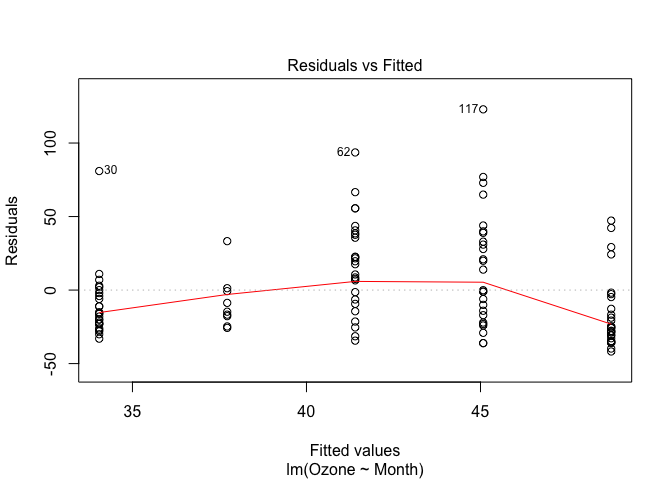
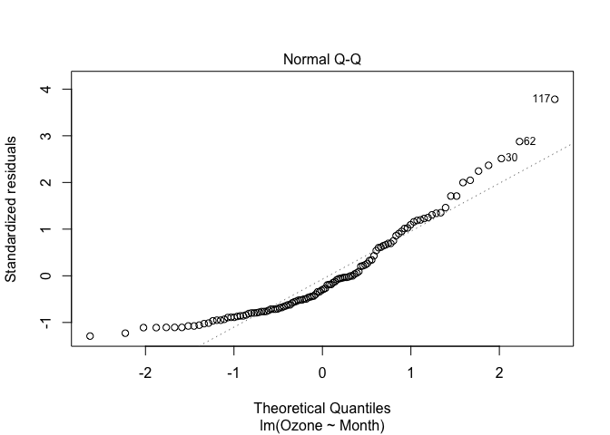
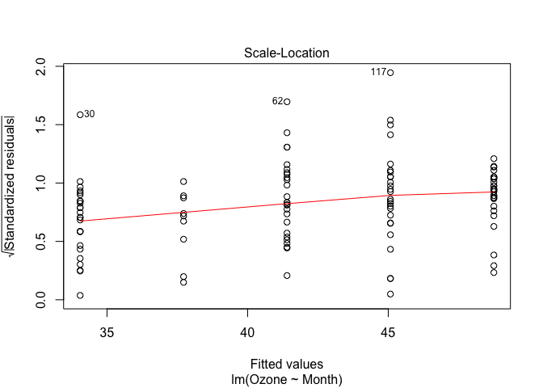
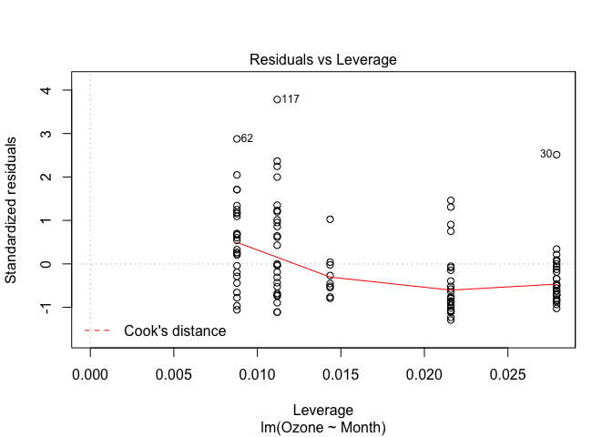

-   [What are Objects?](#what-are-objects)
    -   [Object terminology](#object-terminology)
-   [Objects in R](#objects-in-r)
-   [Base Types](#base-types)
    -   [Vectors](#vectors)
    -   [Matrices & Arrays](#matrices-arrays)
    -   [Data Frames](#data-frames)
    -   [Etc.](#etc.)
-   [S3 Objects](#s3-objects)
    -   [Example: Extending S3 Objects](#example-extending-s3-objects)
-   [S4 Objects](#s4-objects)
-   [References](#references)

What are Objects?
=================

Objects are, roughly, data (or more generally a stored state) that knows
what it can do.

We know what happens when we put this troublesome `+` guy between
numbers

    1 + 1 # ud better b sitting down

    ## [1] 2

But it's less clear what it means to `+` letters

    "a" + "b"

    ## Error in "a" + "b": non-numeric argument to binary operator

Let's see what `typeof` variables `1` and `"a"` are :

    typeof(1)

    ## [1] "double"

    typeof("a")

    ## [1] "character"

> (note this is a little misleading, `typeof` determines the base object
> class that an R object is stored as. All R objects are composed of
> base objects, we'll get to the types of objects in the next section)

Object terminology
------------------

A **class** is the description, or 'blueprint' of how individual
**objects** or **instances** are made, including their **attributes** -
which data should be kept and what it should be named, and **methods**,
the functions that they are capable of calling on their stored data or
attributes. Objects can have a nested structure, and sub-classes can
**inherit** the attributes and methods of their parent classes.

For example: As a class, trucks have attributes like engine\_size,
number\_of\_wheels, or number\_of\_jumps\_gone\_off. Trucks have the
method go\_faster(), but only individual instances of trucks can
go\_faster() - the concept/class of trucks can't. As a subclass,
monster\_trucks also have the attributes engine\_size, etc. and the
method go\_faster(), but they also have additional attributes like
mythical\_backstory and methods like monster\_jam().

Objects in R
============

> "In R functions are objects and can be manipulated in much the same
> way as any other object." - *R language guide 2.1.5*

> "S3 objects are functions that call the functions of their objects" -
> *Also R*

R has base types and three object-oriented systems.

-   **Base types:** Low-level C types. Build the other object systems.

-   **S3 - "Casual objects":** Objects that use **generic functions**.
    S3 methods "belong to" functions, not classes. Functions contain the
    **UseMethod("function\_name", object)** function (see `?UseMethod`).

-   **S4 - "Formal objects":** Formal classes with inheritance and means
    by which methods can be shared between classes. S4 methods still
    "belong to" functions, but classes are more rigorously defined.

-   **Reference classes:** Objects that use **message passing** - or the
    method 'belongs to' the object instance rather than the class. This
    is the common `dataframe$column_name` syntax.

The easiest way to see everything about an object is to use the str()
function, short for structure. For example we can see everything about
the lamest linear model ever

    lame_model <- lm(c(1,2,3) ~ c(4,5,6))
    str(lame_model)

    ## List of 12
    ##  $ coefficients : Named num [1:2] -3 1
    ##   ..- attr(*, "names")= chr [1:2] "(Intercept)" "c(4, 5, 6)"
    ##  $ residuals    : Named num [1:3] -9.06e-17 1.81e-16 -9.06e-17
    ##   ..- attr(*, "names")= chr [1:3] "1" "2" "3"
    ##  $ effects      : Named num [1:3] -3.46 -1.41 -2.22e-16
    ##   ..- attr(*, "names")= chr [1:3] "(Intercept)" "c(4, 5, 6)" ""
    ##  $ rank         : int 2
    ##  $ fitted.values: Named num [1:3] 1 2 3
    ##   ..- attr(*, "names")= chr [1:3] "1" "2" "3"
    ##  $ assign       : int [1:2] 0 1
    ##  $ qr           :List of 5
    ##   ..$ qr   : num [1:3, 1:2] -1.732 0.577 0.577 -8.66 -1.414 ...
    ##   .. ..- attr(*, "dimnames")=List of 2
    ##   .. .. ..$ : chr [1:3] "1" "2" "3"
    ##   .. .. ..$ : chr [1:2] "(Intercept)" "c(4, 5, 6)"
    ##   .. ..- attr(*, "assign")= int [1:2] 0 1
    ##   ..$ qraux: num [1:2] 1.58 1.26
    ##   ..$ pivot: int [1:2] 1 2
    ##   ..$ tol  : num 1e-07
    ##   ..$ rank : int 2
    ##   ..- attr(*, "class")= chr "qr"
    ##  $ df.residual  : int 1
    ##  $ xlevels      : Named list()
    ##  $ call         : language lm(formula = c(1, 2, 3) ~ c(4, 5, 6))
    ##  $ terms        :Classes 'terms', 'formula'  language c(1, 2, 3) ~ c(4, 5, 6)
    ##   .. ..- attr(*, "variables")= language list(c(1, 2, 3), c(4, 5, 6))
    ##   .. ..- attr(*, "factors")= int [1:2, 1] 0 1
    ##   .. .. ..- attr(*, "dimnames")=List of 2
    ##   .. .. .. ..$ : chr [1:2] "c(1, 2, 3)" "c(4, 5, 6)"
    ##   .. .. .. ..$ : chr "c(4, 5, 6)"
    ##   .. ..- attr(*, "term.labels")= chr "c(4, 5, 6)"
    ##   .. ..- attr(*, "order")= int 1
    ##   .. ..- attr(*, "intercept")= int 1
    ##   .. ..- attr(*, "response")= int 1
    ##   .. ..- attr(*, ".Environment")=<environment: R_GlobalEnv> 
    ##   .. ..- attr(*, "predvars")= language list(c(1, 2, 3), c(4, 5, 6))
    ##   .. ..- attr(*, "dataClasses")= Named chr [1:2] "numeric" "numeric"
    ##   .. .. ..- attr(*, "names")= chr [1:2] "c(1, 2, 3)" "c(4, 5, 6)"
    ##  $ model        :'data.frame':   3 obs. of  2 variables:
    ##   ..$ c(1, 2, 3): num [1:3] 1 2 3
    ##   ..$ c(4, 5, 6): num [1:3] 4 5 6
    ##   ..- attr(*, "terms")=Classes 'terms', 'formula'  language c(1, 2, 3) ~ c(4, 5, 6)
    ##   .. .. ..- attr(*, "variables")= language list(c(1, 2, 3), c(4, 5, 6))
    ##   .. .. ..- attr(*, "factors")= int [1:2, 1] 0 1
    ##   .. .. .. ..- attr(*, "dimnames")=List of 2
    ##   .. .. .. .. ..$ : chr [1:2] "c(1, 2, 3)" "c(4, 5, 6)"
    ##   .. .. .. .. ..$ : chr "c(4, 5, 6)"
    ##   .. .. ..- attr(*, "term.labels")= chr "c(4, 5, 6)"
    ##   .. .. ..- attr(*, "order")= int 1
    ##   .. .. ..- attr(*, "intercept")= int 1
    ##   .. .. ..- attr(*, "response")= int 1
    ##   .. .. ..- attr(*, ".Environment")=<environment: R_GlobalEnv> 
    ##   .. .. ..- attr(*, "predvars")= language list(c(1, 2, 3), c(4, 5, 6))
    ##   .. .. ..- attr(*, "dataClasses")= Named chr [1:2] "numeric" "numeric"
    ##   .. .. .. ..- attr(*, "names")= chr [1:2] "c(1, 2, 3)" "c(4, 5, 6)"
    ##  - attr(*, "class")= chr "lm"

R has a useful package `pryr` for inspecting objects and other
meta-linguistic needs. Let's get that now.

    # install.packages("pryr")

We can query any object's type with pryr's `otype`

    pryr::otype(c(1,2,3,4,5)) # A vector is a base object

    ## [1] "base"

    pryr::otype(data.frame(x=c(1,2,3,4,5))) # A dataframe is an S3 object

    ## [1] "S3"

Base Types
==========

Every R object is built out of basic C structures that define how it is
stored and managed in memory.

This table from [Advanced
R](http://adv-r.had.co.nz/Data-structures.html#data-structures)
summarizes them:

<table>
<thead>
<tr class="header">
<th></th>
<th>Homogenous data</th>
<th>Heterogenous data</th>
</tr>
</thead>
<tbody>
<tr class="odd">
<td>1-Dimensional</td>
<td>Atomic Vector</td>
<td>List</td>
</tr>
<tr class="even">
<td>2-Dimensional</td>
<td>Matrix</td>
<td>Data frame</td>
</tr>
<tr class="odd">
<td>N-Dimensional</td>
<td>Array</td>
<td></td>
</tr>
</tbody>
</table>

Recall that we can use `typeof()` to find an object's base type

    typeof(1)

    ## [1] "double"

    typeof(list(1,2,3))

    ## [1] "list"

Vectors
-------

Vectors are sequences, the most basic data type in R. They have two
varieties: **atomic vectors** (with homogenous values) and **lists**
(with ... heterogenous values).

R has no 0-dimensional, scalar types, so individual characters or
numbers are length=one atomic vectors. They are:

<table>
<thead>
<tr class="header">
<th>Atomic Vector Type</th>
<th>Example</th>
</tr>
</thead>
<tbody>
<tr class="odd">
<td>Logical</td>
<td><code>booleans &lt;- c(TRUE, FALSE, NA)</code></td>
</tr>
<tr class="even">
<td>Integer</td>
<td><code>integers &lt;- c(1L, 2L, 3L)</code></td>
</tr>
<tr class="odd">
<td>Double</td>
<td><code>doubles &lt;- c(1, 2.5, 0.005)</code></td>
</tr>
<tr class="even">
<td>Character</td>
<td><code>characters &lt;- c(&quot;apple&quot;, &quot;banana&quot;)</code></td>
</tr>
</tbody>
</table>

`raw` and `complex` types also exist, but they are rare.

Vectors are constructed with `c()`. When heterogeneous vectors are
constructed with `c()`, they are *coerced* to the most permissive vector
type (an integer can be both a double (floating point numbers with
decimal points) and character "1") - the table above is ordered from
least to most permissive.

    vect_1 <- c(1L, 2L, 3L)
    vect_2 <- c(1L, 2L, 3)
    vect_3 <- c(1L,2,"3")

    typeof(vect_1)

    ## [1] "integer"

    typeof(vect_2)

    ## [1] "double"

    typeof(vect_3)

    ## [1] "character"

    # We select elements of vectors with [] notation
    vect_1[1]

    ## [1] 1

    vect_3[1]

    ## [1] "1"

To make a vector that preserves the types of its elements, make a `list`
instead

    a_list <- list(1L,2,"3")
    a_list

    ## [[1]]
    ## [1] 1
    ## 
    ## [[2]]
    ## [1] 2
    ## 
    ## [[3]]
    ## [1] "3"

    typeof(a_list[[1]])

    ## [1] "integer"

    typeof(a_list[[2]])

    ## [1] "double"

    typeof(a_list[[3]])

    ## [1] "character"

Notice the double bracket notation `[[]]`. Lists are commonly recursive,
ie. they store other lists. Since the elements of our list are
themselves lists, single bracket indexing `[]` returns lists, and `[[]]`
returns the the elements in that list.

    is.recursive(a_list)

    ## [1] TRUE

    a_list[1]

    ## [[1]]
    ## [1] 1

    typeof(a_list[1])

    ## [1] "list"

    # Indexing recursive lists
    b_list <- list(1:3, c("apple", "banana", "cucumber"))
    b_list

    ## [[1]]
    ## [1] 1 2 3
    ## 
    ## [[2]]
    ## [1] "apple"    "banana"   "cucumber"

    b_list[1]

    ## [[1]]
    ## [1] 1 2 3

    b_list[1][1]

    ## [[1]]
    ## [1] 1 2 3

    b_list[[1]]

    ## [1] 1 2 3

    b_list[[1]][1]

    ## [1] 1

Similarly to coersion among atomic vectors, vectors that contain lists
will be coerced to lists.

    c(1,2,3)

    ## [1] 1 2 3

    c(c(1),c(2,3))

    ## [1] 1 2 3

    c(c(1),list(2,3))

    ## [[1]]
    ## [1] 1
    ## 
    ## [[2]]
    ## [1] 2
    ## 
    ## [[3]]
    ## [1] 3

    list(c(1,2,3), c("a","b","c"))

    ## [[1]]
    ## [1] 1 2 3
    ## 
    ## [[2]]
    ## [1] "a" "b" "c"

    # Unlist turns lists back into (flat) atomic vectors
    unlist(list(c(1,2,3), c("a","b","c")))

    ## [1] "1" "2" "3" "a" "b" "c"

Because they are the most general form of vector, lists are used as the
base type for many derived classes, like data frames

    typeof(data.frame(c(1,2,3)))

    ## [1] "list"

Matrices & Arrays
-----------------

**Arrays** are atomic vectors with a `dim` attribute (more about
attributes in 2.2). **Matrices** are arrays with `dim = 2`.

    array_1 <- array(1:24, dim=c(2,3,4))
    array_2 <- matrix(1:24, ncol=3, nrow=8)
    array_3 <- c(1:24)
    dim(array_3) <- c(2,3,4)
    # or attr(array_3, "dim") <- c(2,3,4)

In higher dimensions, c() becomes `cbind(), rbind()`, and `abind()`;
column and row bind for matrices and array bind for arrays.

    by_columns <- cbind(c(1,2,3), c(4,5,6), c(7,8,9))
    by_columns

    ##      [,1] [,2] [,3]
    ## [1,]    1    4    7
    ## [2,]    2    5    8
    ## [3,]    3    6    9

    by_rows <- rbind(c(1,2,3), c(4,5,6), c(7,8,9))
    by_rows

    ##      [,1] [,2] [,3]
    ## [1,]    1    2    3
    ## [2,]    4    5    6
    ## [3,]    7    8    9

    abind::abind(by_columns, by_rows, along=1)

    ##      [,1] [,2] [,3]
    ## [1,]    1    4    7
    ## [2,]    2    5    8
    ## [3,]    3    6    9
    ## [4,]    1    2    3
    ## [5,]    4    5    6
    ## [6,]    7    8    9

    abind::abind(by_columns, by_rows, along=2)

    ##      [,1] [,2] [,3] [,4] [,5] [,6]
    ## [1,]    1    4    7    1    2    3
    ## [2,]    2    5    8    4    5    6
    ## [3,]    3    6    9    7    8    9

    abind::abind(by_columns, by_rows, along=3)

    ## , , 1
    ## 
    ##      [,1] [,2] [,3]
    ## [1,]    1    4    7
    ## [2,]    2    5    8
    ## [3,]    3    6    9
    ## 
    ## , , 2
    ## 
    ##      [,1] [,2] [,3]
    ## [1,]    1    2    3
    ## [2,]    4    5    6
    ## [3,]    7    8    9

Data Frames
-----------

Data frames are one of the gems of R. A data frame is a list of equal
length vectors.

    df <- data.frame(little_ones = c(0,1,2,3,4),
                     big_ones = c(5,6,7,8,9))
    df

    ##   little_ones big_ones
    ## 1           0        5
    ## 2           1        6
    ## 3           2        7
    ## 4           3        8
    ## 5           4        9

dfs can be used like lists of vectors

    df[1]

    ##   little_ones
    ## 1           0
    ## 2           1
    ## 3           2
    ## 4           3
    ## 5           4

    df[[1]]

    ## [1] 0 1 2 3 4

    df[[1]][1] # as above

    ## [1] 0

Or using `names`, which we'll cover in more detail in 2.2.

    names(df)

    ## [1] "little_ones" "big_ones"

    colnames(df)

    ## [1] "little_ones" "big_ones"

    rownames(df)

    ## [1] "1" "2" "3" "4" "5"

    df$little_ones 

    ## [1] 0 1 2 3 4

    df$big_ones

    ## [1] 5 6 7 8 9

Data frames also inherit the methods of lists and vectors

    df2 <- data.frame(medium_ones = c(3,4,5,6,7))
    cbind(df, df2)

    ##   little_ones big_ones medium_ones
    ## 1           0        5           3
    ## 2           1        6           4
    ## 3           2        7           5
    ## 4           3        8           6
    ## 5           4        9           7

    df_squared <- cbind(df2, df2)
    names(df_squared) <- names(df)
    rbind(df,df_squared)

    ##    little_ones big_ones
    ## 1            0        5
    ## 2            1        6
    ## 3            2        7
    ## 4            3        8
    ## 5            4        9
    ## 6            3        3
    ## 7            4        4
    ## 8            5        5
    ## 9            6        6
    ## 10           7        7

\`\`\`

Etc.
----

Functions, environments, and other stuff that we'll learn about in our
section on Functions are also base objects, but we'll discuss them then.

S3 Objects
==========

S3 objects "belong to" functions, S4 objects "have" functions (methods).
S3 classes don't really "exist," but are assigned as an object's "class"
attribute.

    x <- 1
    attr(x, "class")

    ## NULL

    class(x) <- "letters"
    attr(x, "class")

    ## [1] "letters"

S3 objects are defined by a series of functions that themselves contain
the `UseMethod()` function - this is described briefly above, try
`?UseMethod` for more detail. These functions extend the generic
function, typically using the syntax `generic.class()` as in the case of
`mean.Date()` for taking the mean of dates. One can list the objects
that have a generic method, and the methods that an object has with
`methods()`

    methods(mean)

    ## [1] mean.Date     mean.default  mean.difftime mean.POSIXct  mean.POSIXlt 
    ## see '?methods' for accessing help and source code

    methods(class="Date")

    ##  [1] -             [             [[            [<-           +            
    ##  [6] as.character  as.data.frame as.list       as.POSIXct    as.POSIXlt   
    ## [11] Axis          c             coerce        cut           diff         
    ## [16] format        hist          initialize    is.numeric    julian       
    ## [21] Math          mean          months        Ops           pretty       
    ## [26] print         quarters      rep           round         seq          
    ## [31] show          slotsFromS3   split         str           summary      
    ## [36] Summary       trunc         weekdays      weighted.mean xtfrm        
    ## see '?methods' for accessing help and source code

By default, the source code of S3 methods is not visible to R, one can
retreive it with \`utils::getS3method\`\`

The `plot` base function is an s3 generic method.

    pryr::ftype(plot) # get a function's type

    ## [1] "s3"      "generic"

By default, if the first argument is a base type compatible with being
points on a scatterplot, the actual function that is called is
`plot.default`, whose source behaves like you'd expect:

    plot.default

    ## function (x, y = NULL, type = "p", xlim = NULL, ylim = NULL, 
    ##     log = "", main = NULL, sub = NULL, xlab = NULL, ylab = NULL, 
    ##     ann = par("ann"), axes = TRUE, frame.plot = axes, panel.first = NULL, 
    ##     panel.last = NULL, asp = NA, ...) 
    ## {
    ##     localAxis <- function(..., col, bg, pch, cex, lty, lwd) Axis(...)
    ##     localBox <- function(..., col, bg, pch, cex, lty, lwd) box(...)
    ##     localWindow <- function(..., col, bg, pch, cex, lty, lwd) plot.window(...)
    ##     localTitle <- function(..., col, bg, pch, cex, lty, lwd) title(...)
    ##     xlabel <- if (!missing(x)) 
    ##         deparse(substitute(x))
    ##     ylabel <- if (!missing(y)) 
    ##         deparse(substitute(y))
    ##     xy <- xy.coords(x, y, xlabel, ylabel, log)
    ##     xlab <- if (is.null(xlab)) 
    ##         xy$xlab
    ##     else xlab
    ##     ylab <- if (is.null(ylab)) 
    ##         xy$ylab
    ##     else ylab
    ##     xlim <- if (is.null(xlim)) 
    ##         range(xy$x[is.finite(xy$x)])
    ##     else xlim
    ##     ylim <- if (is.null(ylim)) 
    ##         range(xy$y[is.finite(xy$y)])
    ##     else ylim
    ##     dev.hold()
    ##     on.exit(dev.flush())
    ##     plot.new()
    ##     localWindow(xlim, ylim, log, asp, ...)
    ##     panel.first
    ##     plot.xy(xy, type, ...)
    ##     panel.last
    ##     if (axes) {
    ##         localAxis(if (is.null(y)) 
    ##             xy$x
    ##         else x, side = 1, ...)
    ##         localAxis(if (is.null(y)) 
    ##             x
    ##         else y, side = 2, ...)
    ##     }
    ##     if (frame.plot) 
    ##         localBox(...)
    ##     if (ann) 
    ##         localTitle(main = main, sub = sub, xlab = xlab, ylab = ylab, 
    ##             ...)
    ##     invisible()
    ## }
    ## <bytecode: 0x7fd66b2d6ff8>
    ## <environment: namespace:graphics>

If the first argument to `plot` has its own `plot` method (ie. that it
is exported by the object's package namespace, more about this in
section 5), that function is called instead. That's why

    aq <- datasets::airquality
    plot(lm(Ozone ~ Month, data=aq))

is different than this nonsensical model

    plot(lme4::lmer(Ozone ~ 0 + (Day | Month), data=aq))

Example: Extending S3 Objects
-----------------------------

> <http://adv-r.had.co.nz/OO-essentials.html> "Creating new methods and
> generics"

    pryr::ftype(mean) # mean is an s3 generic function

    ## [1] "s3"      "generic"

    x <- 1
    class(x) <- "just_one"

    # We give our "just_one" class a mean method:
    mean.just_one <- function(x, ...) print("that's just a one you maniac")

    # Mean behaves like it should for numbers and lists of numbers
    mean(1)

    ## [1] 1

    mean(c(1,1.5))

    ## [1] 1.25

    # Other objects have their own mean() method
    methods(mean)

    ##  [1] mean,ANY-method          mean,Matrix-method      
    ##  [3] mean,sparseMatrix-method mean,sparseVector-method
    ##  [5] mean.Date                mean.default            
    ##  [7] mean.difftime            mean.just_one           
    ##  [9] mean.POSIXct             mean.POSIXlt            
    ## see '?methods' for accessing help and source code

    # like Date objects
    dates <- c("01jan2000","15jan2000")
    attr(dates,"class")

    ## NULL

    mean(dates) # Don't work

    ## Warning in mean.default(dates): argument is not numeric or logical:
    ## returning NA

    ## [1] NA

    # turn it into "Date" object
    dates <- as.Date(dates, "%d%b%Y") # base has a set of "as" methods to convert types
    attr(dates,"class")

    ## [1] "Date"

    mean(dates) # will call its method

    ## [1] "2000-01-08"

    mean.Date(dates) # which can also be called directly

    ## [1] "2000-01-08"

S4 Objects
==========

S4 objects have a single class definition with specifically defined
fields and functions. So we could pretend for awhile we're another class
with S3 functions

    a <- data.frame(a="test")
    class(a)

    ## [1] "data.frame"

    class(a) <- "lm"

References
==========

-   <http://manuals.bioinformatics.ucr.edu/home/programming-in-r#TOC-Object-Oriented-Programming-OOP->
-   <http://www.stat.ucla.edu/%7Ecocteau/stat202a/resources/docs/S4Objects.pdf>
-   <http://adv-r.had.co.nz/OO-essentials.html>

------------------------------------------------------------------------

    # S4 Methods are stored in environments 
    nM <- asNamespace("Matrix")
    sort(grep("^[.]__T__", names(nM), value=TRUE))

    ##   [1] ".__T__-:base"                ".__T__!:base"               
    ##   [3] ".__T__[:base"                ".__T__[<-:base"             
    ##   [5] ".__T__*:base"                ".__T__/:base"               
    ##   [7] ".__T__&:base"                ".__T__%*%:base"             
    ##   [9] ".__T__%/%:base"              ".__T__%&%:Matrix"           
    ##  [11] ".__T__%%:base"               ".__T__^:base"               
    ##  [13] ".__T__+:base"                ".__T__all:base"             
    ##  [15] ".__T__all.equal:base"        ".__T__any:base"             
    ##  [17] ".__T__anyNA:base"            ".__T__Arith:base"           
    ##  [19] ".__T__as.array:base"         ".__T__as.integer:base"      
    ##  [21] ".__T__as.logical:base"       ".__T__as.matrix:base"       
    ##  [23] ".__T__as.numeric:base"       ".__T__as.vector:base"       
    ##  [25] ".__T__band:Matrix"           ".__T__BunchKaufman:Matrix"  
    ##  [27] ".__T__cbind2:methods"        ".__T__chol:base"            
    ##  [29] ".__T__chol2inv:base"         ".__T__Cholesky:Matrix"      
    ##  [31] ".__T__coerce:methods"        ".__T__coerce<-:methods"     
    ##  [33] ".__T__colMeans:base"         ".__T__colSums:base"         
    ##  [35] ".__T__Compare:methods"       ".__T__cov2cor:stats"        
    ##  [37] ".__T__crossprod:base"        ".__T__determinant:base"     
    ##  [39] ".__T__diag:base"             ".__T__diag<-:base"          
    ##  [41] ".__T__diff:base"             ".__T__dim:base"             
    ##  [43] ".__T__dim<-:base"            ".__T__dimnames:base"        
    ##  [45] ".__T__dimnames<-:base"       ".__T__drop:base"            
    ##  [47] ".__T__expand:Matrix"         ".__T__expm:Matrix"          
    ##  [49] ".__T__facmul:Matrix"         ".__T__forceSymmetric:Matrix"
    ##  [51] ".__T__format:base"           ".__T__head:utils"           
    ##  [53] ".__T__image:graphics"        ".__T__initialize:methods"   
    ##  [55] ".__T__is.finite:base"        ".__T__is.infinite:base"     
    ##  [57] ".__T__is.na:base"            ".__T__isDiagonal:Matrix"    
    ##  [59] ".__T__isSymmetric:base"      ".__T__isTriangular:Matrix"  
    ##  [61] ".__T__kronecker:base"        ".__T__length:base"          
    ##  [63] ".__T__Logic:base"            ".__T__lu:Matrix"            
    ##  [65] ".__T__Math:base"             ".__T__Math2:methods"        
    ##  [67] ".__T__mean:base"             ".__T__nnzero:Matrix"        
    ##  [69] ".__T__norm:base"             ".__T__Ops:base"             
    ##  [71] ".__T__pack:Matrix"           ".__T__print:base"           
    ##  [73] ".__T__prod:base"             ".__T__qr:base"              
    ##  [75] ".__T__qr.coef:base"          ".__T__qr.fitted:base"       
    ##  [77] ".__T__qr.Q:base"             ".__T__qr.qty:base"          
    ##  [79] ".__T__qr.qy:base"            ".__T__qr.R:base"            
    ##  [81] ".__T__qr.resid:base"         ".__T__rbind2:methods"       
    ##  [83] ".__T__rcond:base"            ".__T__rep:base"             
    ##  [85] ".__T__rowMeans:base"         ".__T__rowSums:base"         
    ##  [87] ".__T__Schur:Matrix"          ".__T__show:methods"         
    ##  [89] ".__T__skewpart:Matrix"       ".__T__solve:base"           
    ##  [91] ".__T__sum:base"              ".__T__summary:base"         
    ##  [93] ".__T__Summary:base"          ".__T__symmpart:Matrix"      
    ##  [95] ".__T__t:base"                ".__T__tail:utils"           
    ##  [97] ".__T__tcrossprod:base"       ".__T__toeplitz:stats"       
    ##  [99] ".__T__tril:Matrix"           ".__T__triu:Matrix"          
    ## [101] ".__T__unname:base"           ".__T__unpack:Matrix"        
    ## [103] ".__T__update:stats"          ".__T__updown:Matrix"        
    ## [105] ".__T__which:base"            ".__T__writeMM:Matrix"       
    ## [107] ".__T__zapsmall:base"

    meth.Ops <- nM$`.__T__Ops:base`
    head(sort(names(meth.Ops)))

    ## [1] "abIndex#abIndex" "abIndex#ANY"     "ANY#abIndex"     "ANY#ddiMatrix"  
    ## [5] "ANY#ldiMatrix"   "ANY#Matrix"
